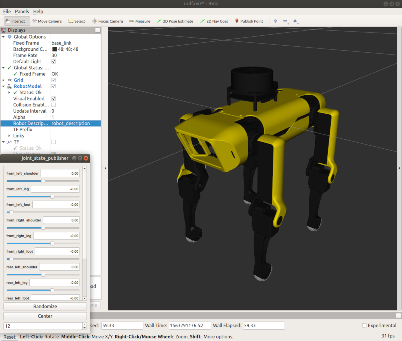

## Abstract:
The SpotMicroAI project is designed to be a low cost, easily built quadruped robot. The design is roughly based off of Boston Dynamics quadruped robot SpotMini, though with obvious adaptations such as size and sensor suite.

The project is maintained by a community of volunteers and is very much still in its early stages. Any individual is welcome to contribute, and in particular expertise in areas involving simulation, reinforcement learning, and hardware development is greatly appreciated.

## Getting started:
COMPLETE DOCUMENTATION AND GETTING STARTED GUIDES CAN BE FOUND AT:
[https://spotmicroai.readthedocs.io/en/latest/](https://spotmicroai.readthedocs.io/en/latest/)

[spotmicroai.readthedocs.io](http://spotmicroai.readthedocs.io)

The best place to get started is to read the getting started documentation at [spotmicroai.readthedocs.io](spotmicroai.readthedocs.io). The documentation will eventually contain a complete tutorial for building a SpotMicroAI including where to source components, links to most recent 3D files for printing, assembly, and installing the software. It's being updated as we go.

For questions or more information please see the [Forums at SpotMicroAI.org](http://SpotMicroAI.org), or asked on slack. Join our slack at: [https://spotmicroai-inviter.herokuapp.com/](https://spotmicroai-inviter.herokuapp.com/)

## Hardware:

The hardware for SpotMicroAI is designed to be both aesthetically pleasing as well as easily obtainable and readily available. Wherever possible standard screws, bolts, and bearings are used. Standard hobby grade servos are currently used for locomotion in development however, they don't appear to have sufficient power to drive the robot at more than the slowest speeds. Other options are currently being investigated (including high-voltage and brushless hobby servos typically used with RC cars) which we hope will lead to a balance between an economical as well as robust robot.

The vast majority of the hardware by volume is designed to be 3D printed. So far complete prints have been successful in PLA, though no technical barriers should exist to printing the robot in other material such as PETG, nylon, ABS, etc. The majority of parts require significant supports to print.

The files available both as STL and STP. As a community we have not yet settled on a servo for this project and therefore multiple versions of the hardware exist to support the physical dimensions of the servos and their respective servo horns. For the most up-to-date version of the hardware please visit: [https://www.thingiverse.com/thing:3761340](https://www.thingiverse.com/thing:3761340). Please see documentation for details as to which files correspond to which servo.

## Electronics:

The brain of this project is designed to be powered by a Raspberry Pi 4. The Pi is connected to a PCA9685 controller board which allows communication to the 12 servos required to articulate the hips and legs.

Sensors include a raspberry pi camera, MPU6050 Gyro accelerometer combination, and several ultrasound sensors. Some users have also integrated a RPiLIDAR A1 into their build.

## Software:

the software in this project is still very immature. Current experience has focused on running C++ directly on the Jetson and preliminary tests have occurred with robot operating system (ROS). The current work has focused on developing a robust gate for the robot and so work on other aspects such as navigation path planning but have not yet started.

Current efforts to develop the gait through reinforcement learning have taken place in the PyBullet. Preliminary work in open AI gym has begun. There has also been discussion about using unity as a platform for reinforcement learning, in particular to be able to utilize the advanced graphics in the game engine for image recognition training on the RPi cam.

## Community:
The primary community discussions take place on SpotMicro.org. The message boards there contain a repository of topics which span hardware and software.

Real-time question-and-answer (or as close to real time as is possible when run by volunteers with full-time jobs and families) can happen on slack (LINK coming soon).

Other questions occasionally surface on other location such as on Thingiverse or on robotshop.com. We do our best answers these as we see them, but if you want to be heard the best way is either on SpotMicro.org or on slack.

As a community we do have some small expenses such as web hosting fees and occasional developing fees. In the future, we would also like to hold events and competitions. To anyone who finds enjoyment or education in this project we appreciate the financial support you're able to give. Donations coming soon.

All donations stay in the community and go towards future development.

If you use this worker will any work derived from it in academic publication please cite it as: *insert citation here*.

