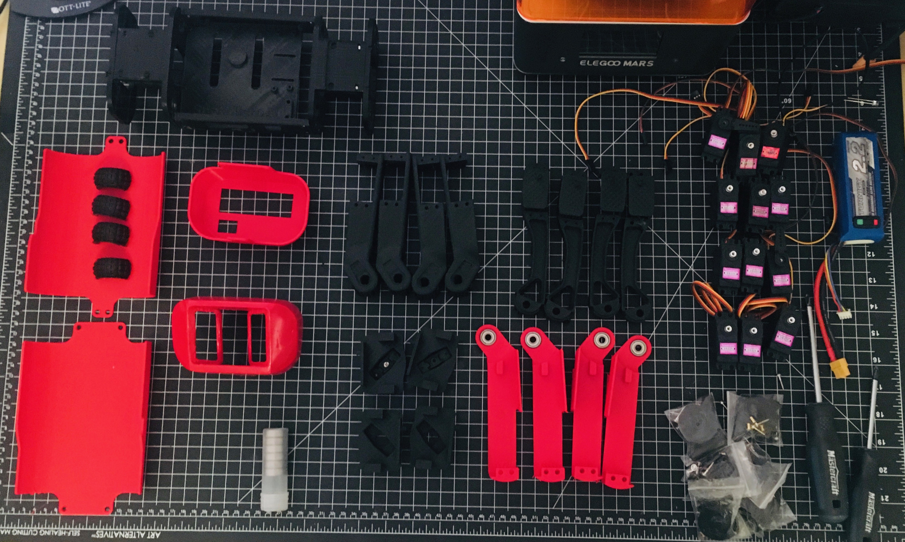

__Collect all the Things!__

To get going, the first thing that you're going to want to do is collect everything you're going to need. The current build of SpotMicroAI requires:
### Electronics 
- 12 × MG 996R servo motor (Towerpro MG996R from hobbyking are also being tested)
- 1 × NVIDIA Jetson Nano/Raspberry Pi 4
- 2 × HC-SR04 Ultrasonic sensor 
- 1 × MPU-6050 Gyro sensor 
- 1 × I2C 16x2 LCD Module 
- 1 × Rleil rocker switch 
- RL3-4 7.4v Battery
- 1 x 16 Channel PCA9685 I2C-Servo Driver

Electronics to Figure out:
- IMU (GY-521)
- 1 × HC-06 Bluetooth module 

Optional Upgraded Parts:
- OLED screen (This should probably be standardized as interfaces should probably have a little variability as possible)
- Better IMU
- LIDAR
- More U/S Sensors

### Sensors

SpotMicroAI has a RPi-Cam, Sonar-Sensors and an IMU Gyro/Accel-Sensor (as designed by KDY). In one of the first versions i added two additional Sonars at the bottom, but i had to remove them again to have space for the voltage regulators. 
TODO: We will need a Bottom-Case version 2 here.

The Rear-Part has space for an OLED-Display (SSD-1306) and a LED Power-Button.
In a first version i used an Arduino Mega as kind of Servo/Sensor-Controller and a Raspberry PI as Locomotion-Controller (communication via UART). But it showed up that the Arduino is too slow to handle Sensor-Signals and Servo-PWM properly at the same time. Now i use the Jetson with the PCA as described above.

I am not sure if the Hardware i use now will be enough to finally have a very smooth walking Robot like for example the real SpotMini. See this more as a Research-Project where I try to use cheap Hardware and other People's Work to learn more about how this all works. 

###Other Hardware (Screws, Nuts and Bearings)
- 8 × 'M5×15' 
- 40 × 'M4×20' 
- 8 × 'M4×15' 
- 48 × 'M4 nut' 
- 4 × 'M3×20' 
- 28 × 'M3×10' 
- 16 × 'M3 nut' 
- 8 × 'F625zz Flange ball bearing'

TODO: Add links for where to purchase hardware

###Tools
- CA Glue/superglue/hotglue
- Phillips Head Screwdriver

### 3D Printed Parts

All Parts were printed in PLA in the current version, with the exception of the paws which were printed in flexible filament. You need to be aware of which servos you are planning to use when you print. 

Parts for corresponding servos:

- The original servos are the MG996R (Unknown source, presumable authentic) and files for those horns can be found at [https://www.thingiverse.com/thing:3445283](https://www.thingiverse.com/thing:3445283). 
- Upgraded servos are the CLS6336HV and corresponding parts can be found at [https://www.thingiverse.com/thing:3445283](https://www.thingiverse.com/thing:3445283).
- Alternate Servos are the MG996R from towerpro (hobbyking) and files can be found at [https://www.thingiverse.com/thing:3761340](https://www.thingiverse.com/thing:3761340).
- .STEP files available at [https://www.thingiverse.com/thing:3761340](https://www.thingiverse.com/thing:3761340).

Skeleton:

- Left Sidewall
- Right Sidewall
- Computer Slab
- Inner Shoulder x 2
- Outer Shoulder x 2

Body Covering:

- Top Cover
- Bottom Cover
- Head
- Hindquarters

Leg (2x each of original orientation and 2x each of flipped orientation):

- Forelimb 4x
- Midlimb 4x
- Midlimb Cover 4x
- Upperlimb 4x
- Paw 4x (All the same orientation)