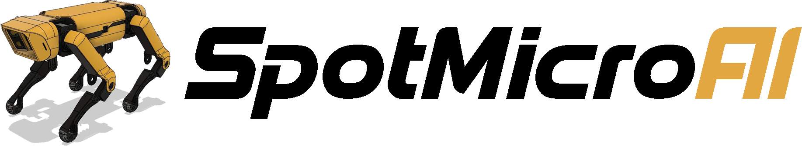
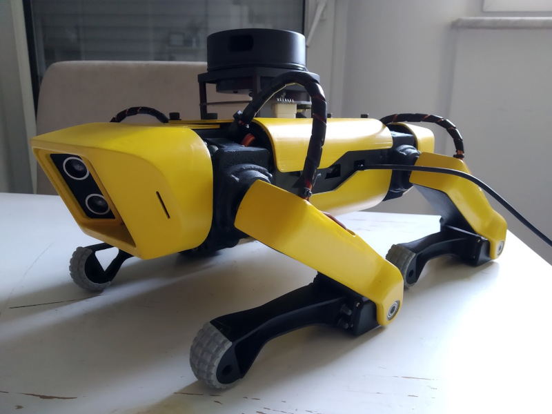

# The Story
The SpotMicro model was originally developed by KDY and released on thingiverse. He has posted that he is required to join the military in his country for two years and so will be absent from development. Hopefully by the time he returns to the community we'll have a fully functional bot that he can come back to.

# Current State
The rest of us are eager to get our hands on a reasonably priced quadruped and so have continued development in his absence. Development happens at the following locations:

- Talk to us on Slack [spotmicroai-inviter.herokuapp.com/](https://spotmicroai-inviter.herokuapp.com/)
- Codebase: [github.com/FlorianWilk/SpotMicroAI](https://github.com/FlorianWilk/SpotMicroAI)
- Documentation: [spotmicroai.readthedocs.io](https://spotmicroai.readthedocs.io)
- STL and STEP Files: 
    - Original and CLS STLs: [https://www.thingiverse.com/thing:3445283](https://www.thingiverse.com/thing:3445283) 
    - Hobbyking MG996R and STEP files: [https://www.thingiverse.com/thing:3761340](https://www.thingiverse.com/thing:3761340)
- Message Board: [http://spotmicro.org](http://spotmicro.org)

# Contributing and TODO:
This project is still very much in its infancy and so any contributions are very much appreciated. Key problems that still need to be addressed are: 

Hardware-Todos:

 - the whole Servo-Setup. MG996R not powerfull enough. try the CLS6336HV Servos. PCA might make the Servos jitter.
 - use an additional VoltageRegulator 7,4->5V for the Jetson Nano
 - build a PowerPack ? x 18650 7,4V ? - not sure if i really should build a PowerPack :) Need help here! 
 - build a nice Adapter-Cable to solve issues with cable-length of all 12 Servos. 
 
Software-Todos / Ideas:
 
 - Documentation and First Build tutorial
 - write a basic RL-based Implementation to support example_automaticgait.py with a "BodyBalancer". ActionSpace is x,y,z of the Body, ObservationSpace pitch,roll,ground_distance,kinematic_motion_function_index
 - create a ROS-Sim-Adapter to map the joint_states to the leg_topic 
 - create an Implementation for the Jetson/RealWorldBot which handles leg_topics -> Servos (incl. calibration)
 - write a Controller-Node, which uses the Kinematics/RL-Model to control the Bot via the leg_topics. This Controller-Node will just be a wrapper for the same logic we use for the PyBullet-Simulation. 
 - Finish the OpenAI-Gym-Env? or
 - try to adapt the "Neural Network Walker"-Example from Bullet to SpotMicroAI? not sure..
 - understand the Marc H. Raibert's Balancing Controller from 1984/86 to possibly merge this ideas into the Action/Observation-Space. Does this make sense?

# License
KDY released this under the [Creative Commons Attribution](http://creativecommons.org/licenses/by/3.0/) license.

 
